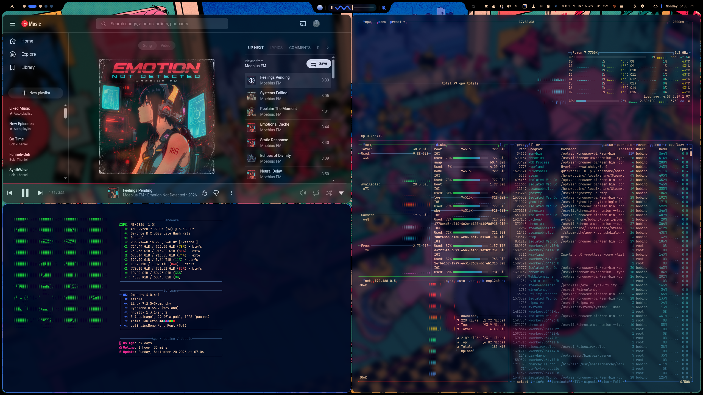
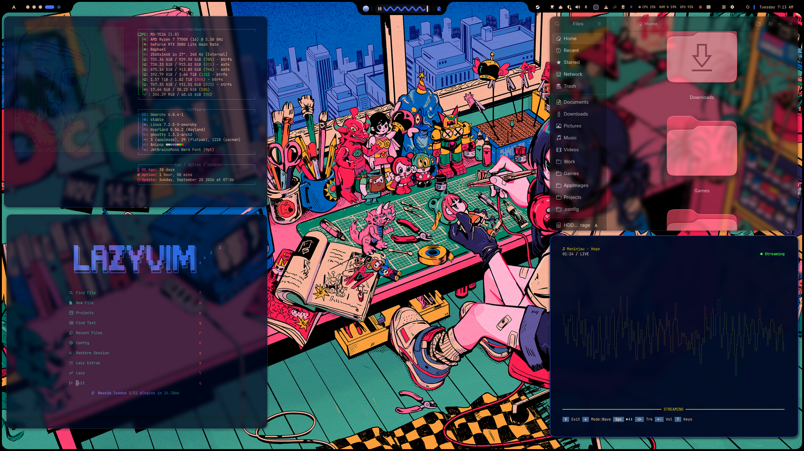
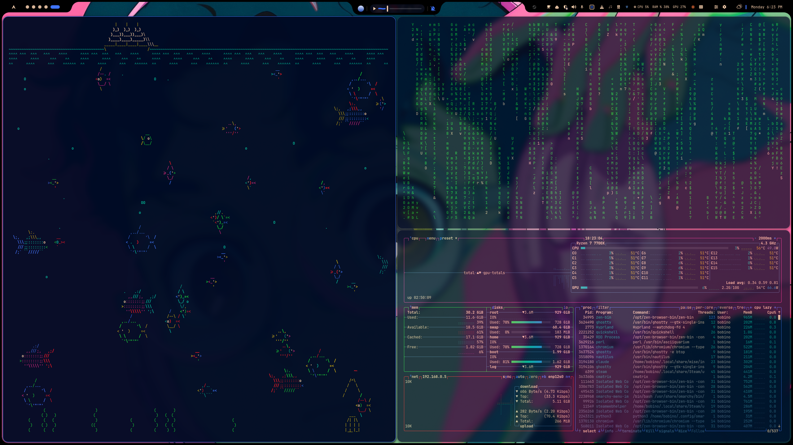

# AniPop

A softer pantone style anime theme to go along with Ruixen-Shell and its more bubbly style. Just something I've been messing with and thought others might enjoy as well. Repo created/managed with Claude.

- Palette: `colors.toml` (drives terminals, btop, Chromium, Neovim, Helix,
  VSCode, Obsidian, and the Omarchy shell)
- Backgrounds: `backgrounds/` — every wallpaper that was in rotation for
  this theme, `anipop-default.png` first. Omarchy picks alphabetically
  first when a theme has never been applied before, and `a` sorts ahead of
  `w`, so `anipop-default.png` (the wallpaper live on the system when this
  was backed up) is what you'll see the first time you apply the theme.
  Cycle through the rest with `omarchy theme bg next`.
- Hyprland window look (rounding, opacity, border, gaps, blur, shadow):
  applied by `hooks/theme-set-anipop.sh` — see below for why this is a hook
  instead of living in `hyprland.lua`
- Icon theme: `icons.theme` — `Yaru-red-dark`

> **Note:** the top bar and command center in the screenshots/recording below is
> Ruixen-Shell, a separate Omarchy shell config — it's not part of this repo
> and installing AniPop won't bring it in on its own. (I haven't tried the windows settings without Ruixen so I'm not sure if the gaps are wonky. Go check it out!: https://github.com/gitcoder89431/ruixen-shell


## Examples

| | |
|---|---|
|  |  |
|  |  |

## Install

```bash
omarchy theme install https://github.com/DasPoxy/AniPop.git
# or, from the Omarchy menu: Style > Themes > Install from URL
```

This clones the repo to `~/.config/omarchy/themes/anipop` and applies it —
you'll get the AniPop colors and background immediately.

### Get the window look too (rounding/opacity/border/gaps/blur)

Omarchy strips every `.lua` file (including `hyprland.lua`) from a theme
installed via `omarchy theme install`, since a theme installed from a repo
can't be allowed to run arbitrary code. That means the window styling has to
be applied as a hook instead, which is a one-time install step:

```bash
omarchy hook install theme-set ~/.config/omarchy/themes/anipop/hooks/theme-set-anipop.sh
```

Hooks live in `~/.config/omarchy/hooks/theme-set.d/` and run on every theme
change; this one checks the theme slug and only touches your Hyprland config
when it's `anipop`. Re-run `omarchy theme set anipop` (or switch to any other
theme and back) after installing the hook to pick it up.

## What the hook applies

| Setting | Value |
|---|---|
| `general:border_size` | 1 |
| `general:gaps_in` | 4 |
| `general:gaps_out` | 10 |
| `decoration:rounding` | 16 |
| `decoration:active_opacity` | 0.98 |
| `decoration:inactive_opacity` | 0.75 |
| `decoration:fullscreen_opacity` | 1 |
| `decoration:blur` | enabled, size 4, passes 2, noise 0.01 |
| `decoration:shadow` | enabled, range 12, power 3, `rgba(00000090)` active / `rgba(00000048)` inactive, offset `0 3` |

Border *color* is left alone — Omarchy regenerates that from `colors.toml`'s
`accent` value for every theme automatically, repo-installed or not.

These are applied live via `hyprctl eval` + `hl.config({...})` on theme-set —
`hyprctl keyword` refuses outright on a Lua-configured Hyprland fork ("keyword
can't work with non-legacy parsers"), so the hook uses the same mechanism a
Lua `hyprland.lua` itself would. On stock (non-Lua-configured) Hyprland, use
`hyprctl --batch "keyword general:border_size 1; ..."` instead — swap the
`hyprctl eval '...'` block in `hooks/theme-set-anipop.sh` for that form. If
something else on your system (a separate `hyprland.lua`, another hook,
`hyprctl reload` re-sourcing your own config) sets these same options
afterward, that will win until AniPop is re-applied — this hook isn't a
persistent config file,
just a re-assert-on-theme-switch.

## Local / hand-edited install (no stripping)

If you'd rather have full control (including the `.lua` files) and don't
need it installable via a URL, skip `omarchy theme install` and just place
the folder directly:

```bash
git clone https://github.com/DasPoxy/AniPop.git /tmp/anipop
rsync -a --exclude .git /tmp/anipop/ ~/.config/omarchy/themes/anipop/
omarchy theme set anipop
```

Copying the files in (rather than leaving a `.git` directory behind) makes
Omarchy treat it as your own hand-written theme, so `hyprland.lua` in this
repo (same border-color config Omarchy's template would generate anyway,
provided as a reference/starting point) is kept as-is instead of stripped —
and in that case the hook above is optional, since `hyprland.lua` will just
work directly.
